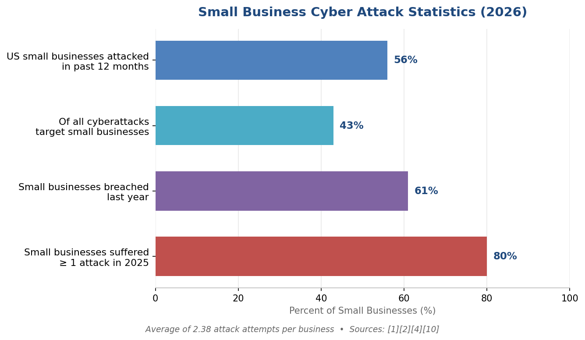
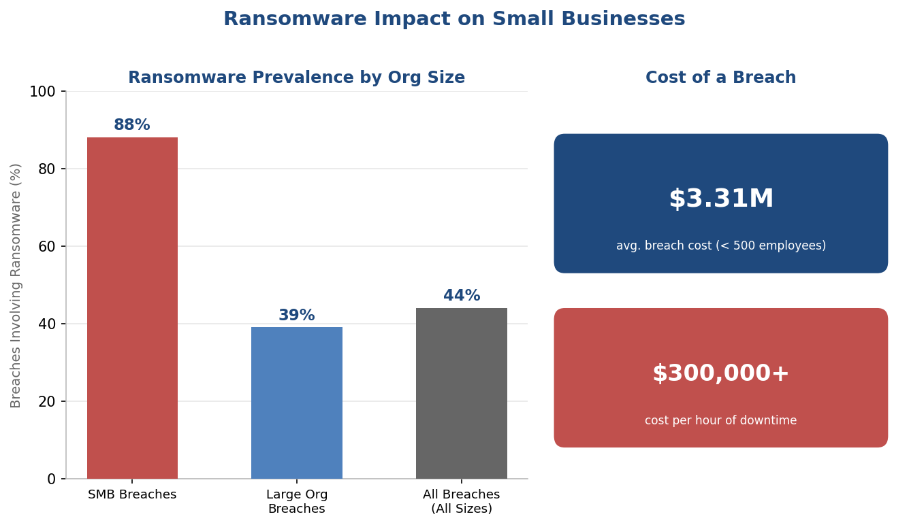
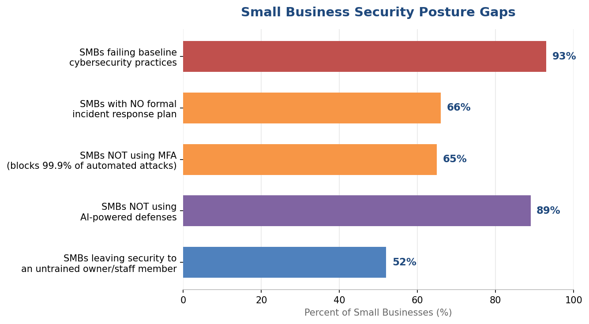
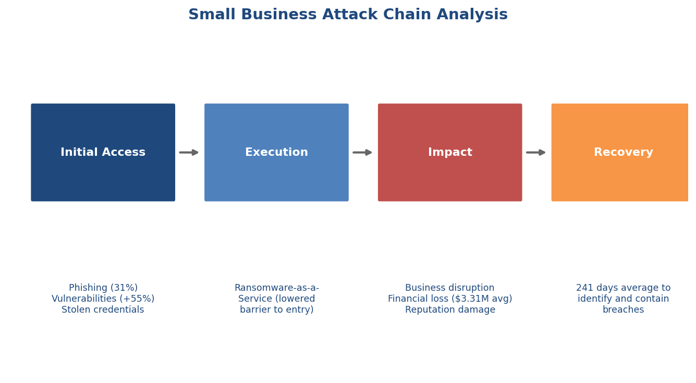
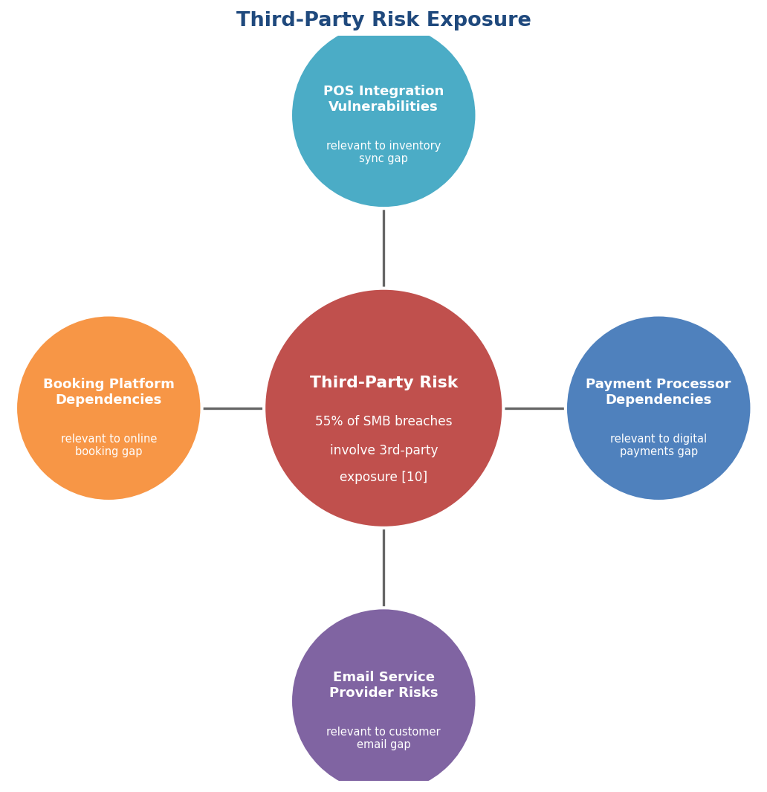
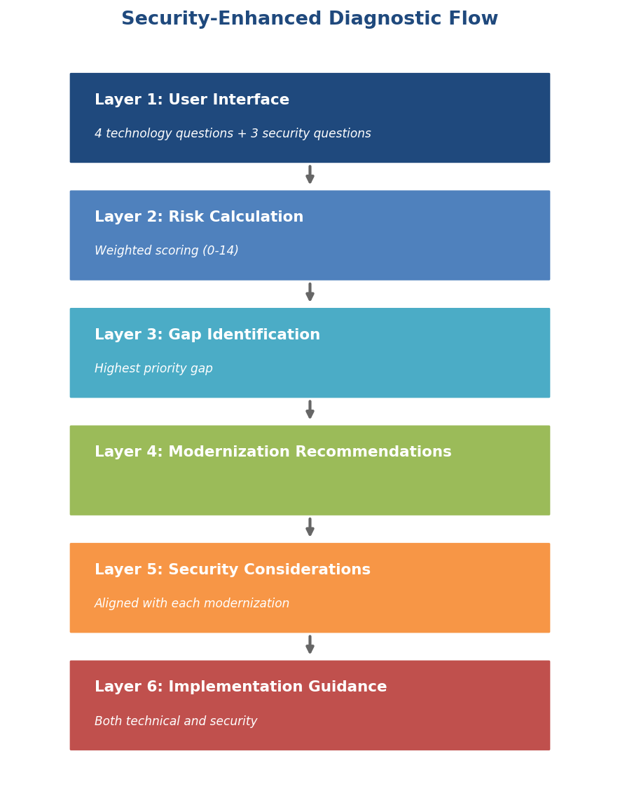
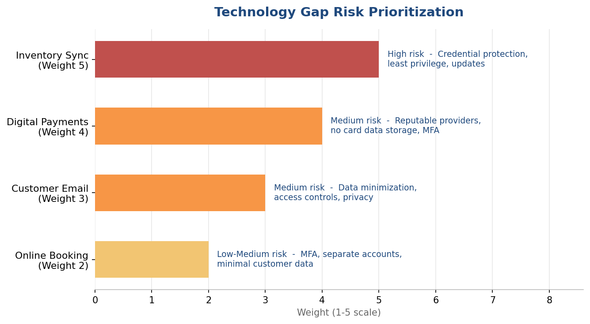
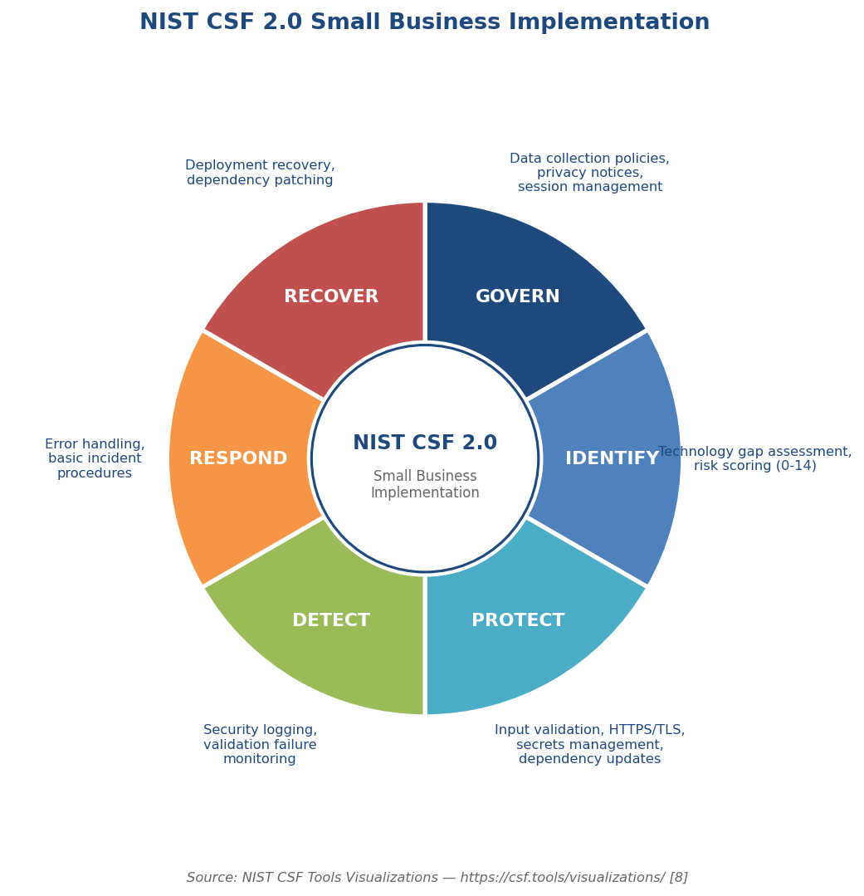
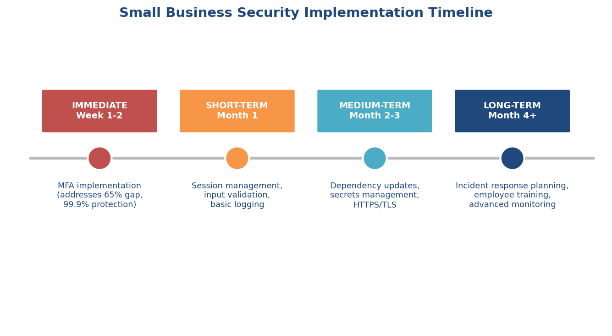

# Cybersecurity Review Report: Business Readiness Check

Assigned project topic: Small Business Tech-Stack Diagnostic Tool

Framework: NIST Cybersecurity Framework 2.0 (Reference Framework)

Alignment: UN SDG Goal 9 - Industry, Innovation, and Infrastructure

## Executive Summary

This security review examines the proposed Python and Streamlit diagnostic tool for small-business owners. The tool assesses four critical technology gaps identified in the project analysis: inventory synchronization, digital payments, customer email capture, and online booking capabilities. Research indicates that 56% of US small businesses experienced cyber attacks in the past year, with 88% of SMB breaches involving ransomware [1][2]. The cybersecurity approach follows data minimization principles, processing responses only during active sessions without permanent storage.

## Small Business Threat Landscape

*Small Business Cyber Attack Statistics (2026)*

*Ransomware Impact on Small Businesses*

*Small Business Security Posture Gaps*

This data, drawn from current small business cybersecurity research, frames why the controls in this review matter: connected IoT devices are the leading entry point for attacks (30%) [1], and 40% of quick service restaurants had payment card data leaked in the past year [4].

### Attack Progression

*Small Business Attack Chain Analysis*

## Project Fragmentation Tax Security Analysis

*Third-Party Risk Exposure*

Third-party dependencies map directly onto this project's four technology gaps: POS integrations relate to the inventory sync gap, payment processors to the digital payments gap, email providers to the customer email gap, and booking platforms to the online booking gap. The table below sets out each gap in full.

| Technology Gap | Business Impact | Risk if “No” | Security Implication |
|---|---|---|---|
| Inventory Sync (Weight 5) | 12% of catalog at risk of stockouts | High | POS system vulnerabilities, credential protection |
| Digital Payments (Weight 4) | Digital wallets already exceed 10,000 transactions | Medium | PCI compliance, payment fraud prevention |
| Customer Email (Weight 3) | 8.65% ghost customers; $3.9M in inaccessible revenue | Medium | Data minimization, privacy controls (breach cost $4.44M) [5] |
| Online Booking (Weight 2) | Beauty & Health category revenue exceeds $2.6M | Low-Medium | Account separation, availability controls |

The four identified technology gaps from the project analysis have the specific security implications above, weighted by risk severity and drawn from the project's e-commerce analysis and Tableau dashboard [10].

## Security Questions & Responses

*Security-Enhanced Diagnostic Flow*

The security controls in this section operate across the six layers shown above, from user input to implementation guidance:

### 1. Information Collection Guidelines

- COLLECT: Business type (retail category), operational status (yes/no responses to 4 diagnostic questions), weighted risk scores (0–14)
- PROHIBITED: Passwords, payment card data, customer PII, API keys, transaction records
- IP ADDRESS POLICY: The application will not intentionally collect or persist IP addresses as part of the diagnostic dataset. Infrastructure-level logs may contain connection metadata depending on the hosting platform.

### 2. Assessment Answer Storage

- Process answers in-memory during active session only. No permanent storage of assessment responses. Session-based temporary processing with automatic cleanup. Recommended session timeout: 30 minutes of inactivity.
- Privacy Notice: "Assessment responses are used for the current assessment session and are not persisted by the application."
- This data minimization approach reduces attack surface and compliance burden, addressing the 93% baseline security failure rate among SMBs [3].

### 3. Input Validation & Safe Report Generation

- Input Validation: Validate that diagnostic answers map only to expected Boolean/category values (Yes/No) and that calculated scores remain within the defined score range (0–14)
- Weight Calculation: Allowed weights are 1–5; final score validation ensures bounds checking
- Business Category Allowlist: Electronics, Clothing, Home & Kitchen, Beauty & Health, Sports & Outdoors, Toys & Games, Books
- Streamlit Security: Use Streamlit's default escaped rendering and avoid unsafe_allow_html=True unless there is a specific, reviewed need [6]

### 4. Privacy and Security Notices

- "Your assessment responses are processed temporarily and are not stored permanently."
- "We do not collect passwords, payment information, or customer data."
- Clear session timeout indicator (30 minutes) and session expiration warnings

### 5. Secure Deployment & Dependencies

- HTTPS/TLS: Deploy behind HTTPS/TLS using the hosting platform's supported secure configuration; prefer modern TLS versions and disable obsolete protocols where configurable
- Recommended Platforms: Streamlit Cloud, Heroku, or similar managed platforms with built-in TLS termination [6]
- Dependency Management: Pin exact dependency versions in requirements.txt; run pip-audit weekly for vulnerability scanning
- Secrets Management: Use environment variables or Streamlit Secrets - never in source control [6]
- Security Headers: Enable Streamlit's server. enableCORS and server. enableXsrfProtection

### 6. Error Handling & Logging

- Graceful error handling without stack trace exposure
- Security event logging (failed validation attempts) without storing user responses
- 30-day log retention policy with ISO 8601 timestamps

### 7. File Upload Protection (Future Enhancement)

- Current diagnostic does not require file upload. If introduced later: extension allowlist → 5MB size limit → filename sanitization → malware scanning → sandboxed processing → temporary storage → delete after processing
- Security Note: Streamlit's caching/session mechanisms can involve Python pickle, which should never be used to deserialize untrusted data [6].

## Business Report Security Recommendations

*Technology Gap Risk Prioritization*

| Gap | Modernization | Security Action |
|---|---|---|
| Inventory Sync | POS integration | Credential protection, least privilege, updates |
| Digital Payments | Digital wallets | Reputable providers, no card data storage, MFA |
| Customer Email | Email capture/CRM | Data minimization, access controls, privacy |
| Online Booking | Online calendar | MFA, separate accounts, minimal customer data |

Every modernization recommendation introduces a corresponding security consideration.

## Cybersecurity Readiness Check

Security Readiness Check after the four technology questions needs to be added:

- Q1: Do employees use separate accounts rather than sharing one login? (Yes/No)
- Q2: Is important business data backed up regularly? (Yes/No)
- Q3: Is multi-factor authentication enabled for important business accounts? (Yes/No)

Scoring: 3/3 = Strong, 2/3 = Developing, 0–1 = Needs Attention

Top Security Action: Enable MFA for email, payment, and accounting admin accounts. This addresses the 65% MFA adoption gap among SMBs [2].

## NIST CSF 2.0 Framework Alignment

*NIST CSF 2.0 Small Business Implementation*

| NIST Function | Implementation Status |
|---|---|
| Govern | Full (privacy policies, data collection decisions) |
| Identify | Full (risk gap identification, weighted scoring) |
| Protect | Full (input validation, HTTPS, secrets, dependencies) |
| Detect | Partial (security logging, validation monitoring) |
| Respond | Partial (error handling, basic incident procedures) |
| Recover | Partial (deployment recovery, dependency updates) |

The security review uses NIST CSF 2.0 as a reference framework [7]. The application does not implement all six NIST functions, as Detect/Respond/Recover are primarily organizational capabilities.

## UN SDG Goal 9 Alignment

- Resilient Infrastructure: NIST's "Protect" function ensures the diagnostic tool is secure, building trust for small businesses to adopt digital solutions
- Inclusive Industrialization: Appropriate security without excessive complexity makes digital modernization accessible to non-technical business owners
- Foster Innovation: Security controls enable safe experimentation with new technologies without exposing businesses to cyber risks

## Security Implementation Roadmap

*Small Business Security Implementation Timeline*

This is the recommended order of implementation, based on the threat data and project analysis above.

## Conclusion

The proposed cybersecurity approach fits the Business Readiness Check. It addresses the security considerations raised in this review, stays aligned with the project's four-gap analysis, supports UN SDG Goal 9, and uses NIST CSF 2.0 as a defensible reference framework. The “no permanent storage” approach for v1.0 is the right security posture for this stage: it limits what could go wrong while still delivering the tool's value. Current research puts the baseline-practice gap at 93%, the MFA adoption gap at 65%, and ransomware prevalence among SMB breaches at 88%, which is why the MFA and session-management controls in the Cybersecurity Readiness Check matter most for a first release [2][3].

Recommendation: Proceed with implementation using the security controls outlined in this review, including the addition of the 3-question Cybersecurity Readiness Check.

## Sources

- [1] Hiscox Cyber Readiness Report 2026: 56% of US small businesses experienced cyber attacks, average 2.38 attempts per business; connected IoT devices are the leading point of entry (30%). [https://www.hiscox.com/documents/Hiscox-Cyber-Readiness-Report-2026.pdf](https://www.hiscox.com/documents/Hiscox-Cyber-Readiness-Report-2026.pdf)
- [2] 2026 SMB Cybersecurity Statistics (Spacelift): 88% of SMB breaches involve ransomware vs. 39% for large organizations; 65% do not use MFA (blocks 99.9% of automated attacks); 43% of all cyberattacks target small businesses; 34% have a formal incident response plan; 11% use AI-powered defenses; 52% rely on untrained staff to manage cybersecurity. [https://spacelift.io/blog/small-business-cybersecurity-statistics](https://spacelift.io/blog/small-business-cybersecurity-statistics)
- [3] SensCy 2026 SMB Benchmark Report: 93% of SMBs fail to follow baseline cybersecurity practices; 107% improvement possible with structured action. [https://senscy.com/new-study-finds-93-of-smbs-fail-to-follow-baseline-cybersecurity-practices/](https://senscy.com/new-study-finds-93-of-smbs-fail-to-follow-baseline-cybersecurity-practices/)
- [4] VikingCloud 2026 Quick Service Restaurant Report: 40% had payment card data leaked, 80% experienced cyber incidents. [https://cybersecuritystats.com/reports/vikingcloud/cyber-risk-supersized-vikingcloud-s-2026-quick-service-fast-casual-restaurant-report](https://cybersecuritystats.com/reports/vikingcloud/cyber-risk-supersized-vikingcloud-s-2026-quick-service-fast-casual-restaurant-report)
- [5] Vantage Point CRM Security Guide 2026: average data breach cost $4.44 million globally, security reduces risk by 70%. [https://vantagepoint.io/blog/sf/crm-data-security-best-practices-2026](https://vantagepoint.io/blog/sf/crm-data-security-best-practices-2026)
- [6] Streamlit Documentation - Trust and Security. [https://docs.streamlit.io/deploy/streamlit-community-cloud/get-started/trust-and-security](https://docs.streamlit.io/deploy/streamlit-community-cloud/get-started/trust-and-security)
- [7] NIST CSF 2.0 Core Publication. [https://tsapps.nist.gov/publication/get_pdf.cfm?pub_id=957258](https://tsapps.nist.gov/publication/get_pdf.cfm?pub_id=957258)
- [8] NIST CSF Tools Visualizations. [https://csf.tools/visualizations/](https://csf.tools/visualizations/)
- [9] Trend Micro, “Point-of-Sale System Breaches: Threats to the Retail and Hospitality Industries” — memory-scraping malware targets POS terminals globally. [https://documents.trendmicro.com/assets/wp/wp-pos-system-breaches.pdf](https://documents.trendmicro.com/assets/wp/wp-pos-system-breaches.pdf)
- [10] Project Report: Small Business Tech-Stack Diagnostic Tool, Team Apex Engineers, 2026. Fragmentation Tax analysis of 100,000+ e-commerce transactions. Internal project document. Interactive dashboard: [https://public.tableau.com/views/SmallBusinessTech-StackDiagnosticToolbyTeamApexEngineer/SmallBusinessTech-StackDiagnosticTool](https://public.tableau.com/views/SmallBusinessTech-StackDiagnosticToolbyTeamApexEngineer/SmallBusinessTech-StackDiagnosticTool)
- [11] SBE Council Small Business Technology Use Survey, March 2026: found high small-business adoption of digital tools, not low adoption as earlier drafts of this review stated — 82% of employers use AI tools and 90% report confidence adopting new digital tools. Referenced in [10]. [https://sbecouncil.org/wp-content/uploads/2026/03/SBE-Technology-Use-Survey-March-2026-Final-2.pdf](https://sbecouncil.org/wp-content/uploads/2026/03/SBE-Technology-Use-Survey-March-2026-Final-2.pdf)
- [12] Lendio Study: mom-and-pop businesses show an average credit score 30 points lower and monthly revenue about $35,000 lower than other small businesses. Referenced in [10]. [https://www.lendio.com/blog/study-mom-and-pop-businesses](https://www.lendio.com/blog/study-mom-and-pop-businesses)

Supporting visualizations and detailed threat data referenced in this report are checked against the project's Tableau dashboard and Project Report [10].
