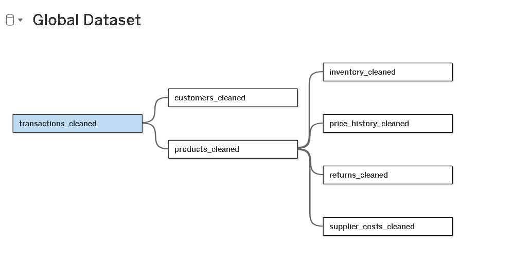
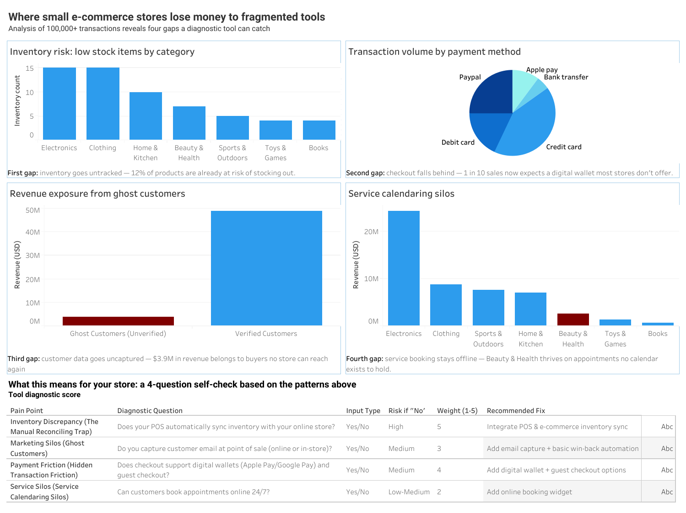

# Business Readiness Check Dashboard Documentation

**Assigned topic:** Small Business Tech-Stack Diagnostic Tool

**Implemented solution:** Business Readiness Check — Team Apex Engineers

Grow with Google / MMC BUILD Stage — UN SDG 9: Industry, Innovation & Infrastructure

**Prepared by:** Aishat Omolabake Ajibola (Advanced Data Analytics track)

**Tool used:** Tableau Public

---

## 1. Purpose

This document records the process of building the interactive dashboard that
supports the team's Business Readiness Check. It covers the data source, data
model, analysis breakdowns, storytelling structure, and technical issues
encountered and resolved along the way.

## 2. Data Source

The dashboard is built on the team's Global Dataset workbook, an e-commerce
dataset modeling a mid-size online store. Seven cleaned analytical tables were
used, plus one separate diagnostic-criteria reference table:

- **transactions_cleaned** (100,000 rows) — core sales data: revenue, payment method, category, per-order detail
- **customers_cleaned** (8,000 rows) — email verification status, used for the Ghost Customers analysis
- **products_cleaned** (500 rows) — category lookup, joined to inventory and transactions
- **inventory_cleaned** (500 rows) — stock levels and reorder points, used for the Inventory Risk chart
- **returns_cleaned** (7,126 rows) — return/refund detail linked to individual transactions
- **price_history_cleaned** (18,000 rows) — monthly listed vs. competitor pricing, promotions, and units sold per product
- **supplier_costs_cleaned** (998 rows) — supplier-level cost and reliability data
- **Diagnostic tool criteria** (4 scored rows) — the team's diagnostic
  scorecard, brought in as a standalone reference table

## 3. Data Model

Relationships (not joins) were used to connect the tables on their shared keys, avoiding row duplication across tables of different grain:

- `transactions_cleaned.customer_id` ↔ `customers_cleaned.customer_id`
- `transactions_cleaned.product_id` ↔ `products_cleaned.product_id`
- `products_cleaned.product_id` ↔ `inventory_cleaned.product_id`, `price_history_cleaned.product_id`, `returns_cleaned.product_id`, `supplier_costs_cleaned.product_id`

The `Diagnostic tool criteria` table was deliberately left unconnected to the relationship model, since it is a static criteria with no shared key to the transactional tables. It was added on its own as a separate data source connection and used only in its own dedicated worksheet.

## 4. Dashboard Views

### 4.1 Inventory Risk
A bar chart of product count by category, filtered to products where `stock_units ≤ reorder_point` (built via a calculated field, *Is Low Stock*). Shows 12% of the 500-product catalog is currently at or below its reorder point, concentrated in Electronics and Clothing.

### 4.2 Transaction Volume by Payment Method
A single merged pie chart (Payment Method on Color, `COUNTD(Transaction Id)` on Angle) showing the distribution of 100,000 transactions across five payment methods, including Apple Pay's growing share.

### 4.3 Revenue Exposure from Ghost Customers
A two-bar comparison (via a *Customer Status* calculated field) of total
revenue from customers with unverified vs. verified emails. Approximately
$3.9M in revenue is associated with customer records whose email status is
unverified. An unverified status does not prove that a customer is unreachable.

### 4.4 Revenue and Transaction Count by Category
A dual-axis combo chart (revenue as bars on the left axis, transaction count as
a line on an unsynchronized right axis) across all seven product categories,
with Beauty & Health highlighted in blue as context for the team's
service-booking idea. The dataset does not contain booking-system or appointment
fields, so booking need remains a project assumption rather than a measured
dataset result.

### 4.5 Tool Diagnostic Score
A static text table reproducing the team's four-question diagnostic scorecard (Pain Point, Diagnostic Question, Input Type, Risk if "No", Weight, Recommended Fix), included as its own standalone data source so it can anchor the dashboard's narrative without needing a join to the transactional data.

## 5. Dashboard Assembly

All five views were combined onto a single dashboard canvas in the following structure:

- A header text block at the top: "Where small e-commerce stores lose money to fragmented tools," with the subtitle "Analysis of 100,000+ transactions reveals four gaps a diagnostic tool can catch."
- The four analysis charts arranged in a grid below the header, each paired with its one-line caption.
- The diagnostic scorecard placed at the bottom as the narrative payoff, introduced by a bridging line connecting it back to the findings above.

The captions were deliberately written as a numbered sequence ("First gap... Second gap... Third gap... Fourth gap...") so the dashboard reads as one continuous story rather than four disconnected charts, closing with the scorecard's "Four gaps, one fix" line to explicitly resolve the count set up in the title.

> **Evidence note:** The dashboard image below preserves the team's original
> analytical narrative. Its statements that customers expect a wallet, that an
> unverified customer cannot be reached, or that a booking calendar does not
> exist are business hypotheses rather than fields directly measured by the
> dataset. The final Business Readiness Check presents them as general
> diagnostic prompts and does not claim that the dataset proves causation.

**Caption:** "Four fragmented-tool gaps hiding in 100,000+ transactions — and the diagnostic scorecard built to catch them, from stockouts and outdated checkout to unreachable customers and unbookable services."

<a href="https://public.tableau.com/app/profile/abbydata/viz/SmallBusinessTech-StackDiagnosticToolbyTeamApexEngineer/SmallBusinessTech-StackDiagnosticTool" alt="view dashboard here"> Click here to view the interactive dashboard </a> 

## 6. Technical Issues Encountered and Resolved

- **Calculated field syntax error (`email_verified`):** corrected the formula box to contain only the logical expression, with the field name kept solely in the calculation's title box.
- **Diagnostic tool criteria table repeatedly breaking the main connection:** re-added it as a second, fully separate Excel connection dedicated only to that table, isolating it from the main relationship model.
- **Recurring "Data Source Error" / blank charts:** resolved through a combination of refreshing/rebuilding the extract and fully restarting Tableau Public to clear a stale session.
- **Oversized dashboard header pushing charts off-screen:** resized the text container by dragging its bottom edge upward to fit the header content only.

## 7. Summary

The finished dashboard translates the team's inventory, payment, and customer
email indicators, plus its explicit service-booking assumption, into a single
interactive narrative. It closes with the diagnostic scorecard that turns
those research inputs into a self-assessment tool for small-business owners.

- Dataset source: [Global E-Commerce & Supply Chain Database on Kaggle](https://www.kaggle.com/datasets/parsakh/global-e-commerce-and-supply-chain-database)

